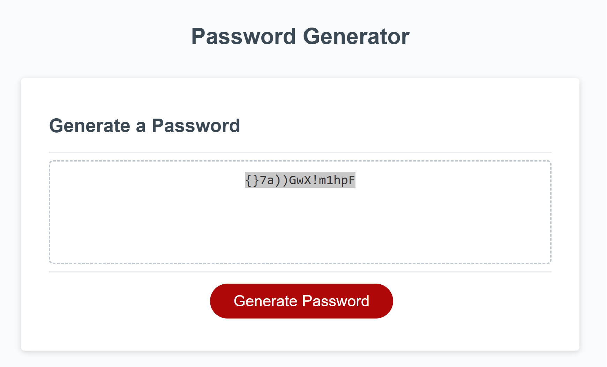

# module-3-challenge

## Description

 create an application that an employee can use to generate a random password based on criteria they've selected follow guidline below.

## Installation

N/A

## Usage
 
GIVEN I need a new, secure password
WHEN I click the button to generate a password
THEN I am presented with a series of prompts for password criteria
WHEN prompted for password criteria
THEN I select which criteria to include in the password
WHEN prompted for the length of the password
THEN I choose a length of at least 8 characters and no more than 128 characters
WHEN asked for character types to include in the password
THEN I confirm whether or not to include lowercase, uppercase, numeric, and/or special characters
WHEN I answer each prompt
THEN my input should be validated and at least one character type should be selected
WHEN all prompts are answered
THEN a password is generated that matches the selected criteria
WHEN the password is generated
THEN the password is either displayed in an alert or written to the page
## Note
watch several youtube videos that guide how to do this challenge
https://www.youtube.com/watch?v=m5XF1OQ6rSg
https://www.youtube.com/watch?v=Xrsb9SiF3a8&pp=ygUScGFzc3dvcmQgZ2VuZXJhdG9y
https://www.youtube.com/watch?v=duNmhKgtcsI&t=1489s&pp=ygUScGFzc3dvcmQgZ2VuZXJhdG9y
https://www.youtube.com/watch?v=7zRMDRISchA&pp=ygUScGFzc3dvcmQgZ2VuZXJhdG9y
https://www.youtube.com/watch?v=x4HUaiazDes&pp=ygUScGFzc3dvcmQgZ2VuZXJhdG9y
https://www.youtube.com/watch?v=v2jfGo7ztm8&t=1113s&pp=ygUScGFzc3dvcmQgZ2VuZXJhdG9y

## Credits

N/A

## License

Please refer to the LICENSE in the repo.

## screenshot

## URL 
https://github.com/AustinN789/module-3-challenge.git

